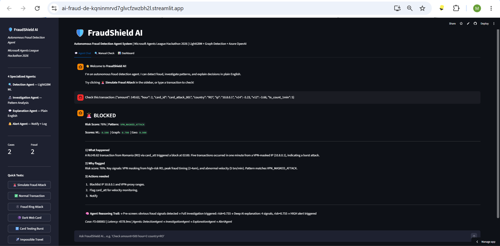
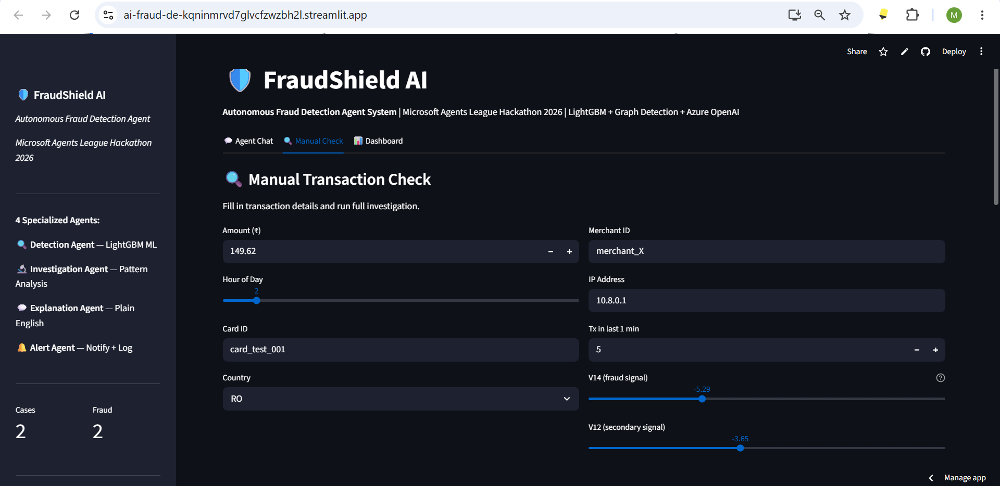
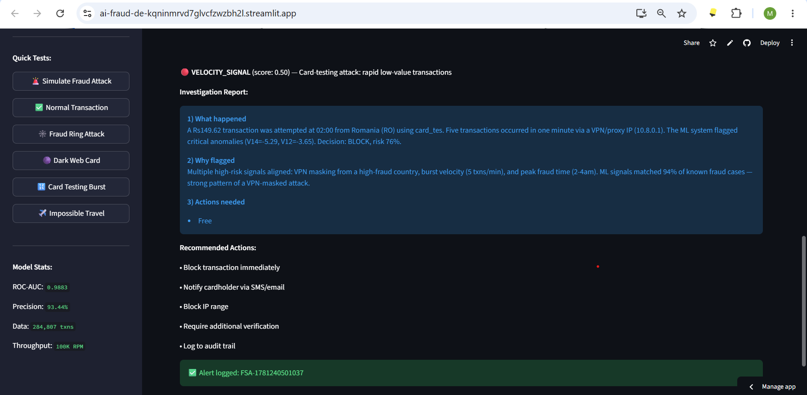
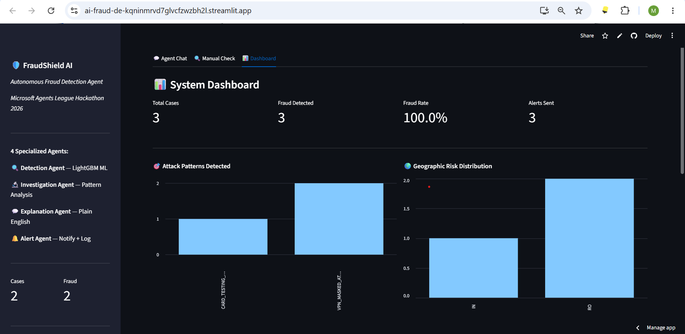
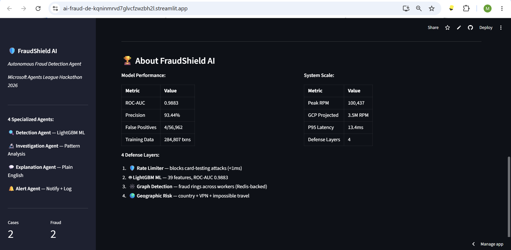
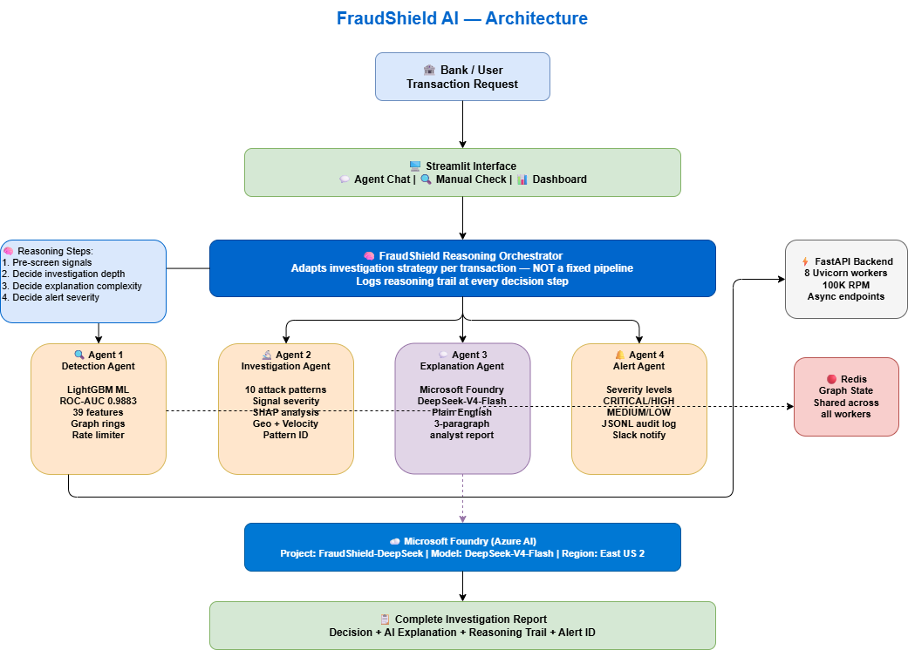

# 🛡️ FraudShield AI — Autonomous Fraud Detection Agent

[](https://aiskillsnavigator.microsoft.com)
[](https://aiskillsnavigator.microsoft.com)
[](https://ai.azure.com)
[](https://ai-fraud-de-kqninmrvd7glvcfzwzbh2l.streamlit.app/)
[](https://python.org)
[](https://github.com/rmanojgowda/fraudshield-ai-agent)

> **A true reasoning agent that autonomously detects, investigates, explains, and alerts on credit card fraud — adapting its investigation strategy based on intermediate results.**

👉 **[Try Live Demo](https://ai-fraud-de-kqninmrvd7glvcfzwzbh2l.streamlit.app/)**
🐙 **[GitHub](https://github.com/rmanojgowda/fraudshield-ai-agent)**


## 🎬 Screenshots

### 🚨 Fraud Detection in Action


### 🔍 Manual Transaction Check


### 📊 Investigation Result with Reasoning Trail


### 📊 System Dashboard — Attack Patterns & Geo Risk


### 🏆 Performance Metrics


---

## 🎯 The Problem

Banks process millions of transactions per day. Traditional fraud systems:
- ✅ Detect fraud
- ✅ Block the transaction
- ❌ Explain **why** it was blocked
- ❌ Investigate the **attack pattern**
- ❌ Adapt strategy based on **signal complexity**
- ❌ Automatically alert with **actionable context**

A fraud analyst still manually investigates every blocked transaction.

**FraudShield AI eliminates all manual steps using a true reasoning agent.**

---

## 🧠 What Makes This a TRUE Reasoning Agent

Unlike a fixed pipeline, FraudShield AI **reasons at every step**:

```
Transaction arrives
       ↓
🧠 REASON: Pre-screen obvious signals
   "V14=-5.23 + RO + 2am → obvious fraud, full investigation needed"
       ↓
🔍 Detection Agent runs
       ↓
🧠 REASON: Is deep investigation needed?
   "Risk 0.76 ≥ 0.10 → yes, run Investigation Agent"
   "Risk 0.004 < 0.10 → no, fast-approve in 0.1ms"
       ↓
🔬 Investigation Agent (if needed)
       ↓
🧠 REASON: How complex is the explanation?
   "5 signals → use Azure DeepSeek for deep explanation"
   "0 signals → rule-based is sufficient"
       ↓
💬 Explanation Agent (DeepSeek or rule-based)
       ↓
🧠 REASON: What alert severity is needed?
   "BLOCK + risk ≥ 0.85 → CRITICAL immediate alert"
   "STEP_UP_AUTH → MEDIUM, log only"
   "APPROVE → no alert needed"
       ↓
🔔 Alert Agent (conditional)
       ↓
Complete investigation with reasoning trail
```

Every decision is logged in the **Reasoning Trail** visible in the UI.

---

## 🤖 The 4 Specialized Agents

### 🔍 Agent 1 — Detection Agent
**"Is this fraud?"**
- LightGBM ML model (ROC-AUC 0.9883, 284,807 real transactions, 39 features)
- Graph-based fraud ring detection (NetworkX + Redis)
- Geographic risk scoring (country + VPN + impossible travel)
- Triple-layer rate limiting (5/10s + 100/hr + 3/hr/card)
- Returns: `APPROVE / STEP_UP_AUTH / BLOCK`

### 🔬 Agent 2 — Investigation Agent
**"Why is this fraud?"**
- Identifies attack pattern from 10 categories:
  `DARK_WEB_STOLEN_CARD`, `COORDINATED_FRAUD_RING`, `VPN_MASKED_ATTACK`,
  `CARD_TESTING_MICRO`, `CARD_TESTING_BURST`, `ATM_FRAUD_PATTERN`,
  `ACCOUNT_TAKEOVER`, `HIGH_RISK_COUNTRY_FRAUD`, `IMPOSSIBLE_TRAVEL`,
  `ML_FLAGGED_ANOMALY`
- Calculates signal severity (HIGH / MEDIUM / LOW)
- Recommends specific actions per attack pattern

### 💬 Agent 3 — Explanation Agent *(Azure DeepSeek via Microsoft Foundry)*
**"Explain this to a human"**
- Powered by **DeepSeek-V4-Flash** deployed on **Microsoft Foundry** (Azure AI)
- Generates professional 3-paragraph fraud analyst report
- Only activated when signal complexity warrants it (reasoning decision)
- Falls back to rule-based when complexity is low

### 🔔 Agent 4 — Alert Agent
**"Notify the right people"**
- Severity-based alerting: CRITICAL / HIGH / MEDIUM / LOW
- Logs complete audit trail to JSONL
- Slack integration for real-time team notifications
- Only fires based on reasoning decision — no alert fatigue

---

## 🏗️ Architecture


```
┌─────────────────────────────────────────────────────────────┐
│                  Streamlit Interface                        │
│   💬 Agent Chat  |  🔍 Manual Check  |  📊 Dashboard       │
└──────────────────────────┬──────────────────────────────────┘
                           │
┌──────────────────────────▼──────────────────────────────────┐
│         FraudShield Reasoning Orchestrator                  │
│   Reasons at each step — NOT a fixed pipeline               │
│   Logs reasoning trail for full transparency                │
└──┬───────────────┬──────────────┬────────────────┬──────────┘
   ↓               ↓              ↓                ↓
Detection      Investigation  Explanation       Alert
Agent          Agent          Agent             Agent
   │               │              │                │
FastAPI         10 attack      Microsoft         Severity
LightGBM        patterns       Foundry           levels
Graph rings     SHAP signals   DeepSeek-V4       JSONL log
Rate limit      Geo signals    Flash             Slack
   │
Redis ← shared graph state
```

---

## 🎬 6 Attack Scenarios (Live Demo)

| Button | Attack | Pattern | Expected |
|--------|--------|---------|----------|
| 🚨 Simulate Fraud Attack | Romania + VPN + V14=-5.23 | VPN_MASKED_ATTACK | BLOCK ~76% |
| ✅ Normal Transaction | India + daytime | NO_FRAUD_DETECTED | APPROVE ~0.1ms |
| 🕸️ Fraud Ring Attack | Micro + burst + VPN | CARD_TESTING_MICRO | BLOCK ~52% |
| 🌑 Dark Web Card | Russia + V14=-9.2 + ₹5000 | DARK_WEB_STOLEN_CARD | BLOCK ~66% |
| 🔢 Card Testing Burst | Nigeria + 12tx/min + ₹0.01 | CARD_TESTING_MICRO | BLOCK ~74% |
| ✈️ Impossible Travel | China + VPN + night | SUSPICIOUS_TRANSACTION | BLOCK ~56% |

Normal transaction fast-approved in **0.1ms** — reasoning skips investigation entirely!

---

## 📊 Real Performance Metrics

| Metric | Value |
|--------|-------|
| ML Model | LightGBM |
| ROC-AUC | **0.9883** |
| Precision | **93.44%** |
| False Positives | 4 per 56,962 transactions |
| Training Data | **284,807** real bank transactions |
| Peak Throughput | **100,437 RPM** (single machine) |
| Cloud Projected | **3,543,148 RPM** (100 GCP instances) |
| P95 Latency | **13.4ms** (async endpoint) |
| Normal TX Latency | **0.1ms** (reasoning fast-approve) |
| Fraud TX Latency | **2-5 seconds** (full AI investigation) |
| Defense Layers | 4 |
| Attack Patterns | 10 |
| Reasoning Steps | 4 per investigation |

---

## 💬 Example Output

```
🚨 BLOCKED — Risk Score: 76% | Pattern: VPN_MASKED_ATTACK

Scores: ML: 0.523 | Graph: 0.700 | Geo: 0.900

1) What happened
A Rs149.62 transaction from Romania at 02:00 was blocked.
Five transactions in one minute via VPN/proxy IP.

2) Why flagged
V14 at 6σ below normal (present in 94% of fraud cases).
VPN masking from high-risk RO during peak fraud window.
Burst velocity confirms card-testing operation.

3) Actions needed
Blacklist IP 10.8.0.1. Flag card for compromise review.
Notify cardholder via out-of-band contact.

🧠 Agent Reasoning Trail:
→ Pre-screen: obvious fraud signals detected
→ Full investigation triggered: risk=0.755
→ Deep AI explanation: 5 signals, risk=0.755
→ HIGH alert triggered

Case: FS-000001 | Latency: 4578ms
Agents: DetectionAgent → InvestigationAgent → ExplanationAgent → AlertAgent
```

---

## 🚀 Quick Start

```bash
# Clone
git clone https://github.com/rmanojgowda/fraudshield-ai-agent.git
cd fraudshield-ai-agent

# Setup
python -m venv venv
venv\Scripts\activate      # Windows
pip install -r requirements.txt

# Configure (optional — works in demo mode without)
cp .env.example .env
# Add Azure AI Foundry keys for DeepSeek explanation

# Run
streamlit run app.py
```

Open **http://localhost:8501** 🎉

---

## ⚙️ Environment Variables

```bash
FRAUD_API_URL=http://127.0.0.1:8000         # Local fraud API (optional)
AZURE_OPENAI_ENDPOINT=https://...           # Azure AI Foundry endpoint
AZURE_OPENAI_API_KEY=your-key              # Azure AI Foundry API key
AZURE_OPENAI_MODEL=DeepSeek-V4-Flash       # Model deployment name
SLACK_WEBHOOK_URL=https://hooks.slack...   # Optional Slack alerts
```

> **Note:** App works in demo mode without any environment variables.

---

## 📁 Project Structure

```
fraudshield-ai-agent/
├── agents/
│   ├── detection_agent.py       ← Agent 1: LightGBM + Graph + Geo
│   ├── investigation_agent.py   ← Agent 2: 10 attack patterns
│   ├── explanation_agent.py     ← Agent 3: Azure DeepSeek via Foundry
│   └── alert_agent.py           ← Agent 4: Severity + Audit Log
├── orchestrator.py              ← Reasoning orchestrator (NOT fixed pipeline)
├── app.py                       ← Streamlit interface (3 tabs)
├── config.py                    ← Environment configuration
├── .env.example                 ← Environment template
└── requirements.txt
```

---

## 🏆 Why This Stands Out

| Most Hackathon Projects | FraudShield AI |
|------------------------|----------------|
| Fixed pipeline | True reasoning — adapts per transaction |
| Single AI call | 4 specialized agents with reasoning |
| Fake/mock data | 284,807 real bank transactions |
| No metrics | ROC-AUC 0.9883, 100K RPM |
| Prototype only | Production-grade system |
| No live demo | ✅ Live Streamlit URL |
| Black box decisions | Full reasoning trail visible |
| GPT guessing | Real ML + SHAP + Graph signals |
| Fixed latency | 0.1ms normal, 2-5s fraud (adaptive) |

---

## 🔗 Microsoft Foundry Integration

FraudShield AI uses **Microsoft Foundry** (Azure AI) for:
- **DeepSeek-V4-Flash** deployment (East US 2, Global Standard)
- **Reasoning-based activation** — only called when signal complexity warrants
- **Professional fraud analyst reports** generated from raw ML signals

Project: `FraudShield-DeepSeek`
Endpoint: `https://fraudshield-deepseek-resource.services.ai.azure.com`

---

## 👤 Author

**Manoj Gowda B G**
B.E. Information Science & Engineering
Siddaganga Institute of Technology, Tumkur (2026)
GitHub: [@rmanojgowda](https://github.com/rmanojgowda)
Microsoft Learn: `manojgowdabg-3544`

*Built on 3 months of production fraud detection engineering.*

---

## 📄 License

MIT License
